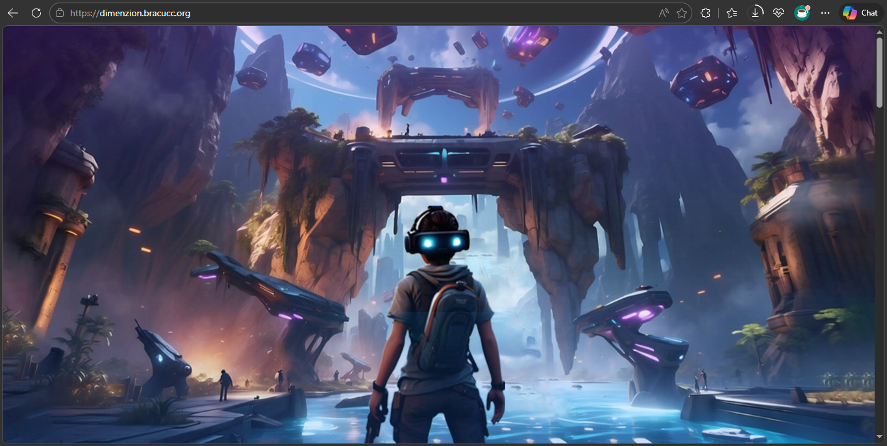
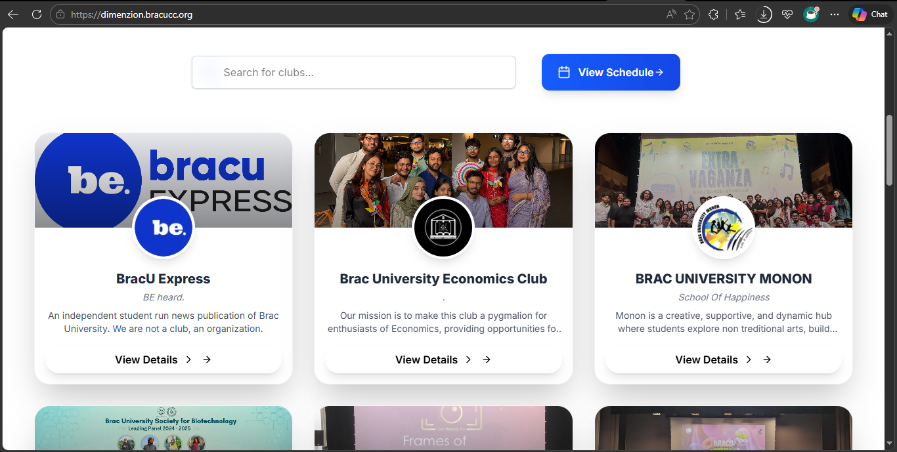
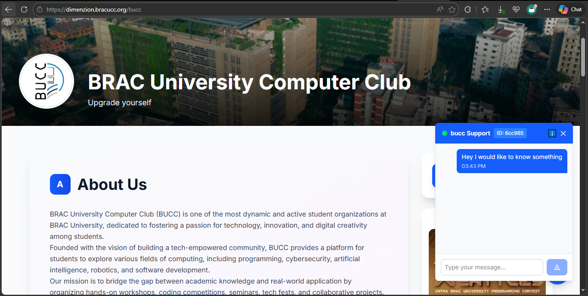
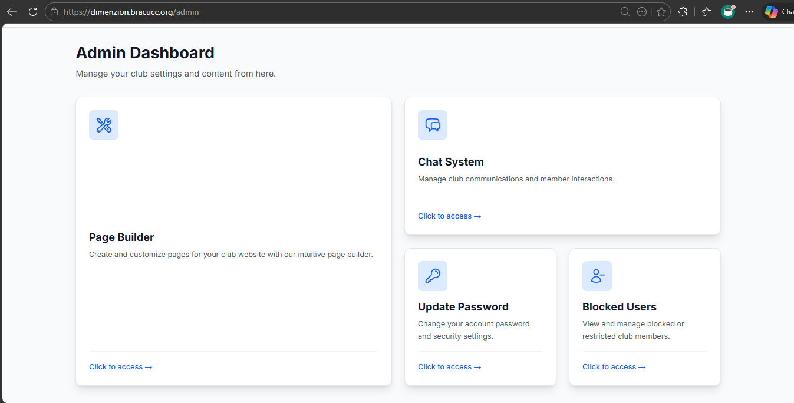
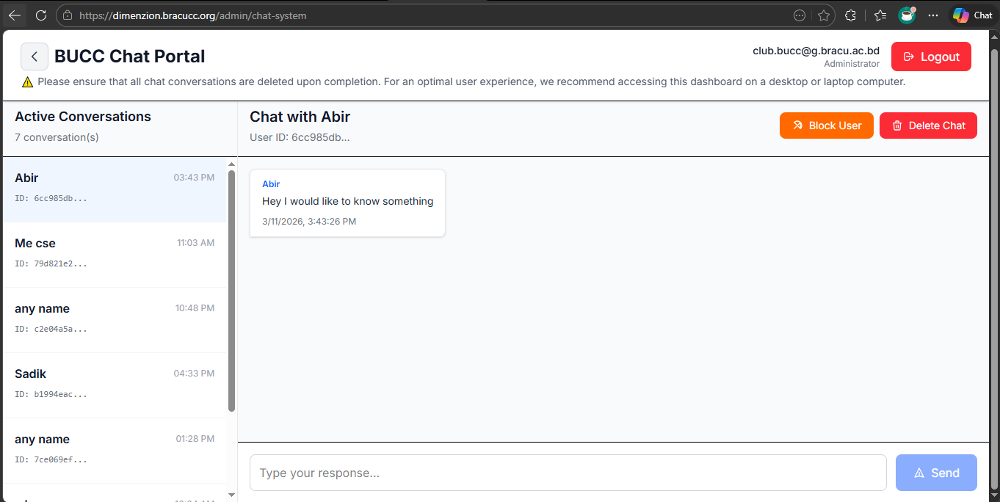
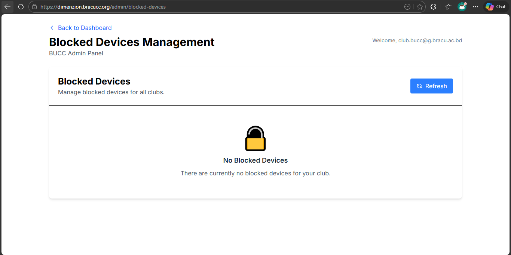

# 🌌 Dimenzion | BUCC Club Fair 2025

> Expanding the physical club fair into a fully interactive digital dimension.

**Dimenzion** is an advanced, full-stack web application built specifically for the BRAC University Computer Club (BUCC) 2025 Club Fair. It serves as the official online counterpart to the physical event, allowing students to explore clubs, interact with representatives in real-time, and securely manage their campus digital identity.

---

## ✨ Core Features

- 💬 **Real-Time Chat System:** Integrated messaging allowing students to directly communicate with club representatives and ask questions instantly.
- 🛡️ **Advanced Security & Device Blocking:** A custom-built security layer that detects and blocks unauthorized devices or malicious actors from accessing the platform.
- 🔐 **Role-Based Authentication:** Secure, multi-tiered access control separating regular students, club representatives, and system administrators.
- 📝 **Dynamic Club Management:** Club admins have full CRUD (Create, Read, Update, Delete) capabilities to edit and update their public-facing club pages on the fly.
- 🌐 **Public Exploration:** A beautifully designed public directory where freshers can browse club manifestos, activities, and recruitment links.

---

## 📸 Platform Gallery

<table>
<tr>
<td align="center">


<em>Home & Event Dashboard</em>

</td>
<td align="center">


<em>Public Club Directory</em>

</td>
</tr>
<tr>
<td align="center">


<em>Real-Time Chat Interface</em>

</td>
<td align="center">


<em>Club Page Editor (Admin View)</em>

</td>
</tr>
<tr>
<td align="center">


<em>Device & Access Control Panel</em>

</td>
<td align="center">


<em>Secure Authentication Portal</em>

</td>
</tr>
</table>

---

## 🔑 Demo Credentials

To explore the different role-based features of the platform, you can log in using the following test accounts connected to our staging database:

| Role                | Email                         | Password          | Access Level                           |
| ------------------- | ----------------------------- | ----------------- | -------------------------------------- |
| **System Admin**    | `admin@dimenzion.bracu.ac.bd` | `adminpass2025`   | Full platform control, device blocking |
| **Club Rep (BUCC)** | `bucc@dimenzion.bracu.ac.bd`  | `clubpass2025`    | Edit BUCC page, answer student chats   |
| **Student**         | `student@g.bracu.ac.bd`       | `studentpass2025` | View clubs, initiate chats             |

---

## 🚀 Tech Stack

- **Framework:** Next.js (React)
- **Database:** MongoDB
- **Authentication:** NextAuth.js / JWT
- **Styling:** Tailwind CSS
- **Real-Time:** WebSockets / Socket.io _(Adjust if using Pusher/Ably)_

---

## ⚙️ Getting Started (Local Development)

Follow these steps to spin up the Dimenzion platform locally.

### 1. Clone the Repository

```bash
git clone https://github.com/your-username/dimenzion.git
cd dimenzion

```

### 2. Install Dependencies

```bash
npm install

```

### 3. Environment Variables

Create a `.env` file in the root directory and add your required keys (Database URI, Auth Secrets, etc.). Example:

```env
MONGODB_URI="your_development_db_string"
NEXTAUTH_SECRET="your_secret_key"

```

### 4. Run the Development Server

```bash
npm run dev

```

Open [http://localhost:3000](https://www.google.com/search?q=http://localhost:3000) with your browser to see the result.
